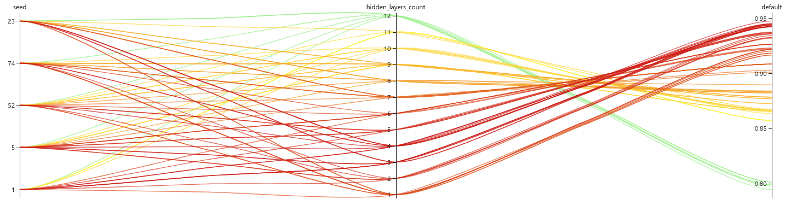
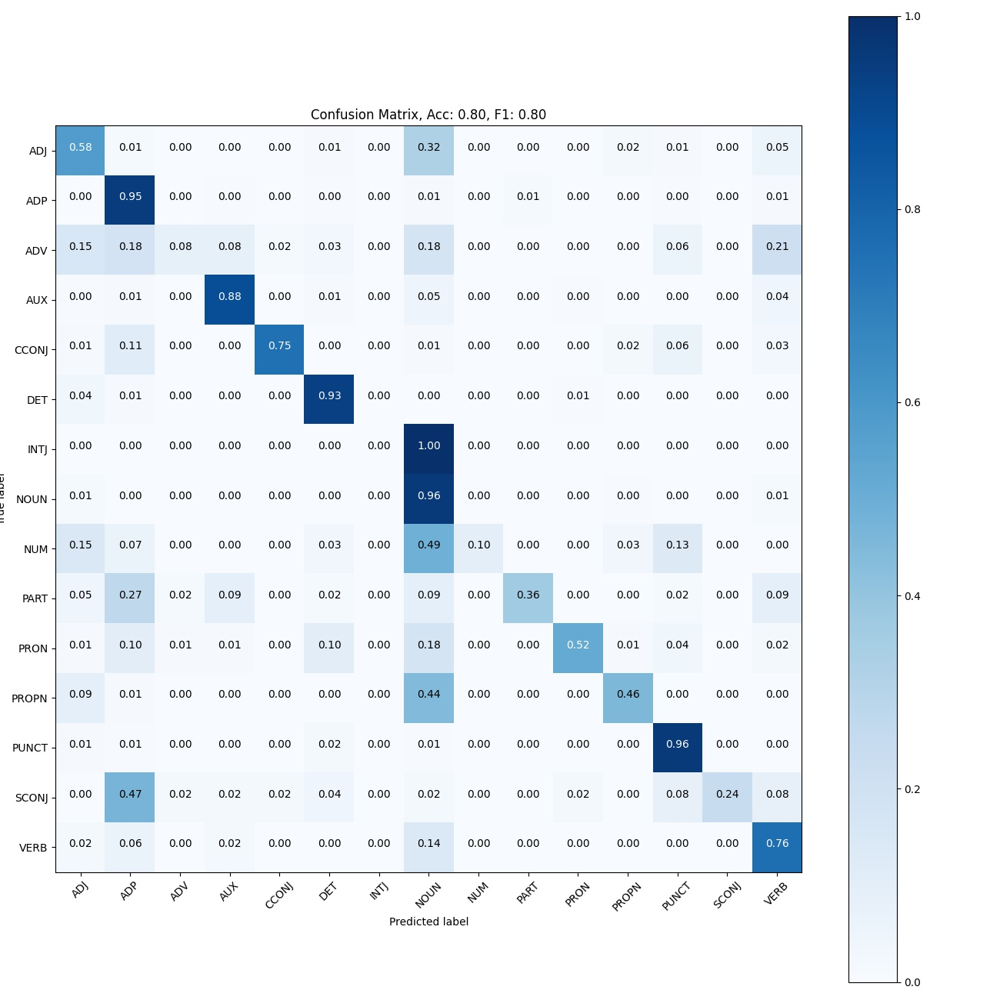

# Linguistic Information in Deep Language Models
The purpose of this project is to explore the linguistic knowledge embedded in Neural Networks, specifically transformres. in this context, the basic linguistic unit is a word and it's part of speech (POS) label.

## Data
we have used the Universal Dependencies English POS dataset.

## Linear Probing Classifier

### Experiments

### Results

## Vanilla BERT embedding distribution
[Uniform Manifold Approximation and Projection for Dimension Reduction](https://arxiv.org/abs/1802.03426) (UMAP) is a manifold based dimension reduction algorithm, useful for visualization of high dimensional data.
I used  it to to visualize the intermediate word representations (as mentioned earlier) in the vanilla BERT model. UMAP has both a supervised and an unsupervised implementations (the labels can be used to improve the dimension reduction process). In the following example, the unsupervised implementation was used as our goal is to observe the POS distribution in the embedding space. dimension reduction from 768-d space to 2-d space is acute, and a lot of data is being lost in the process. It allows us to glimpse to the data distribution in higher dimension, but does not accurately represent it.  
### Experiment 
in order to study the vanilla BERT language model linguistic knowledge distribution, it was used to process the train set data without any training.   
as seen earlier, the intermediate 3rd and 4th layers yieled the best representation vectors for linear POS probe classifier.

### Results
Below are the unsupervised UMAP visualization results of the intermediate embedding vectors of the words in their context in the train set.
the embedding vectors yielded by the final layer are mostly disorganized, and do not form distinguishable POS clusters. It is not surprising, because of the following reasons:
- deeper layers in large neural networks tend to learn abstract and high level concepts
- BERT's pretraining task did not include POS tagging
- the contextual nature of the embedding yields different representations to the the same word

There are 2 POS groups that are indeed distinguishable; punctuation and determiner. in other words, the representation vectors of those groups are not as affected by context as the other groups. I believe it is because of the following:
- punctuation and determiner do not carry much semantic data
- [Clark et. al.](https://arxiv.org/abs/1906.04341) showed that BERT attention heads usually attend to  ',' and '.' tokens at deeper layers. Therefore, those tokens' embedding vectors might not be as affected by their context, hence they cluster. further examing of the "PUNCT" cluster in the visualization reveals the the same tokens cluster together, suggesting that Clark et al findings might apply to other punctuation tokens as well  

 

### 4th layer
