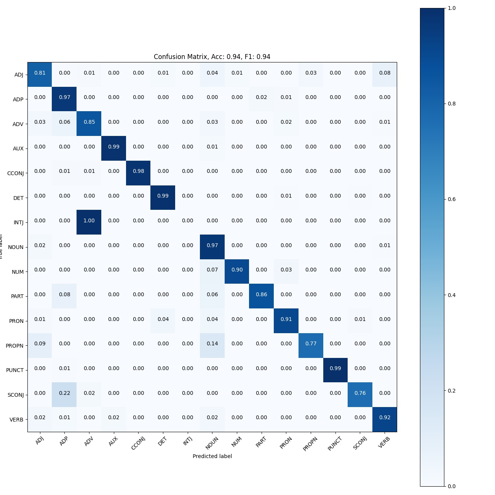

# Linguistic Information in Deep Language Models
The purpose of this project is to explore the linguistic knowledge embedded in Neural Networks, specifically transformres. in this context, the basic linguistic unit is a word and it's part of speech (POS) label.
For convenience the [pretrained transformer network by Devalin et al.](https://arxiv.org/abs/1810.04805) will be referred to as "Vanilla" BERT.  

## Data
The [Universal Dependencies](https://github.com/UniversalDependencies/UD_English-ParTUT) dataset was used. the data is split to 3 groups (train/dev/test) with 1780/156/153 sentences accordingly. As our aim is to study POS classification, all the words in every sentence can be used as data for the model. So, the actual dataset is composed of 43545/2723/3412 words with tagged POS

| word    | label   | text                                                                                                                                                                                                                                                                                                                |   word_offset |
|:--------|:--------|:--------------------------------------------------------------------------------------------------------------------------------------------------------------------------------------------------------------------------------------------------------------------------------------------------------------------|--------------:|
| stand   | VERB    | Ukraine will stand up to the bully – on our own, if necessary.                                                                                                                                                                                                                                                      |             3 |
| If      | SCONJ   | If they do not, if businesspeople feel marginalised, if entrepreneurs cannot take part, not only in managing but also in receiving these funds, we will have missed an opportunity to attain our objectives more rapidly.                                                                                           |             1 |
| society | NOUN    | Balzac's vision of a society in which class, money and personal ambition are the major players has been endorsed by critics of both left-wing and right-wing political tendencies.                                                                                                                                  |             6 |
| very    | ADV     | This report is very good and our Group supports it.                                                                                                                                                                                                                                                                 |             4 |
| ANY     | DET     | EXCEPT TO THE EXTENT REQUIRED BY APPLICABLE LAW, IN NO EVENT WILL LICENSOR BE LIABLE TO YOU ON ANY LEGAL THEORY FOR ANY SPECIAL, INCIDENTAL, CONSEQUENTIAL, PUNITIVE OR EXEMPLARY DAMAGES ARISING OUT OF THIS LICENSE OR THE USE OF THE WORK, EVEN IF LICENSOR HAS BEEN ADVISED OF THE POSSIBILITY OF SUCH DAMAGES. |            20 |  

### Data Exploration
Every word in the sentences is tagged

#### Tokens per Word
BERT is a subword model, and each word can be decomposed to multiple subword 
<table>
<tr><th> Train </th><th> Dev </th><th> Test </th></tr>

<tr>
<td>

|   Tokens/Word |   Count |
|--------------:|--------:|
|             0 |      55 |
|             1 |   41015 |
|             2 |    1388 |
|             3 |     729 |
|             4 |     161 |
|             5 |      24 |
|             6 |       6 |

</td><td>

|   Tokens/Word |   Count |
|--------------:|--------:|
|             0 |      11 |
|             1 |    2528 |
|             2 |      82 |
|             3 |      73 |
|             4 |      12 |
|             5 |       2 |
|             6 |       1 |

</td><td>

|   Tokens/Word |   Count |
|--------------:|--------:|
|             0 |      13 |
|             1 |    3271 |
|             2 |      73 |
|             3 |      41 |
|             4 |       6 |
|             5 |       2 |

</td></tr>

</table>

<table>
<tr><th> Train </th><th> Dev </th><th> Test </th></tr>

<tr>
<td>

|   Tokens/Word |   Count |
|--------------:|--------:|
|             0 |      55 |
|             1 |   41015 |
|             2 |    1388 |
|             3 |     729 |
|             4 |     161 |
|             5 |      24 |
|             6 |       6 |

</td><td>

|   Tokens/Word |   Count |
|--------------:|--------:|
|             0 |      11 |
|             1 |    2528 |
|             2 |      82 |
|             3 |      73 |
|             4 |      12 |
|             5 |       2 |
|             6 |       1 |

</td><td>

|   Tokens/Word |   Count |
|--------------:|--------:|
|             0 |      13 |
|             1 |    3271 |
|             2 |      73 |
|             3 |      41 |
|             4 |       6 |
|             5 |       2 |

</td></tr>

</table>

#### Sentence Length distribution
the sentence length distribution and statistics is presented below, per each set. The sentences are are relatively short, so the default BERT maximum sequence length configuration is redundant.     

<table>
<tr><th> Train </th><th> Dev </th><th> Test </th></tr>

<tr>
<td>

|       |   word_count |
|:------|-------------:|
| count |    1780      |
| mean  |      21.2225 |
| std   |      12.6585 |
| min   |       1      |
| 25%   |      13      |
| 50%   |      19      |
| 75%   |      27      |
| 95%   |      43      |
| max   |     173      |

</td><td>

|       |   word_count |
|:------|-------------:|
| count |    156       |
| mean  |     14.8526  |
| std   |      8.60068 |
| min   |      2       |
| 25%   |      8       |
| 50%   |     13       |
| 75%   |     20       |
| 95%   |     31.25    |
| max   |     39       |

</td><td>

|       |   word_count |
|:------|-------------:|
| count |     153      |
| mean  |      19.8824 |
| std   |       9.7427 |
| min   |       2      |
| 25%   |      14      |
| 50%   |      18      |
| 75%   |      25      |
| 95%   |      35      |
| max   |      64      |

</td></tr>
</table>

#### Tokens per sentence
Further diving into the sentence lengths, it can be easily infered that that the tokens count is relatively short as well. BERT's default sequence length is redundant, and a smaller sequence length can be utilized to increase batch size (training and inference speedup) 
<table>
<tr><th> Train </th><th> Dev </th><th> Test </th></tr>

<tr>
<td>

|       |   tokens_per_sentence |
|:------|----------------------:|
| count |            43378      |
| mean  |               36.2704 |
| std   |               21.6934 |
| min   |                3      |
| 25%   |               23      |
| 50%   |               32      |
| 75%   |               45      |
| 90%   |               58      |
| 95%   |               69      |
| max   |              217      |

</td><td>

|       |   tokens_per_sentence |
|:------|----------------------:|
| count |             2709      |
| mean  |               25.9162 |
| std   |               11.1605 |
| min   |                5      |
| 25%   |               18      |
| 50%   |               25      |
| 75%   |               33      |
| 90%   |               41      |
| 95%   |               45      |
| max   |               53      |

</td><td>

|       |   tokens_per_sentence |
|:------|----------------------:|
| count |             3406      |
| mean  |               30.2519 |
| std   |               15.5721 |
| min   |                5      |
| 25%   |               21      |
| 50%   |               26      |
| 75%   |               34      |
| 90%   |               52      |
| 95%   |               61      |
| max   |               93      |

</td></tr>
</table>

#### Label Distribution
The following table presents the label distribution per each set. Nouns is the class with most occurrences in the sets, and the top-5 most occurring labels are the same as well. "X" and "_" labels, mostly refer to mid-word dashes, contraptions, non-english words and other outliers which do not have defined syntactic roles. Subsequently, these words were dropped as they are outliers that do not serve our goal.    
<table>
<tr><th> Train </th><th> Dev </th><th> Test </th></tr>

<tr>
<td>

| Type   |   Count |
|:-------|--------:|
| NOUN   |    9249 |
| ADP    |    5220 |
| PUNCT  |    5105 |
| DET    |    4616 |
| VERB   |    4126 |
| ADJ    |    3410 |
| AUX    |    2076 |
| PROPN  |    2033 |
| PRON   |    1734 |
| ADV    |    1707 |
| CCONJ  |    1472 |
| PART   |    1168 |
| NUM    |     787 |
| SCONJ  |     627 |
| X      |     140 |
| SYM    |      42 |
| _      |      27 |
| INTJ   |       6 |

</td><td>

| Type   |   Count |
|:-------|--------:|
| NOUN   |     568 |
| PUNCT  |     353 |
| ADP    |     297 |
| VERB   |     276 |
| DET    |     266 |
| ADJ    |     210 |
| PRON   |     153 |
| AUX    |     124 |
| ADV    |     108 |
| PROPN  |     107 |
| CCONJ  |      88 |
| NUM    |      60 |
| PART   |      56 |
| SCONJ  |      41 |
| X      |      13 |
| SYM    |       2 |
| _      |       1 |

</td><td>

| Type   |   Count |
|:-------|--------:|
| NOUN   |     753 |
| ADP    |     488 |
| DET    |     439 |
| PUNCT  |     339 |
| VERB   |     326 |
| AUX    |     234 |
| ADJ    |     224 |
| ADV    |     131 |
| PRON   |     106 |
| CCONJ  |      96 |
| PROPN  |      90 |
| PART   |      66 |
| NUM    |      61 |
| SCONJ  |      51 |
| _      |       4 |
| INTJ   |       2 |
| X      |       2 |

</td></tr>
</table>

## Vanilla BERT Linear Probing Classifier

### Word Representation
BERT is a sub-word level model; a single word can be decomposed to multiple tokens 

### Experiments
Our goal is to study how BERT's intermediate layers embed linguistic knowledge. We extracted the contextual representation vectors from each Transformer unit, resulting in 12 768-d representation vectors for each word. 
We trained a different linear classifier on each layers' output, predicting POS label. To prove consistency, each classifier was trained with 5 different random seeds. BERT's inner weights were frozen, and no fine-tuning was conducted. The accuracy and micro-average F1 score were chosen to assess performance, as the data is unbalanced.  

### Results
As seen below, BERT's 3rd and 4th hidden transformer units yield the best results, thus they learn linguistic knowledge the best. Constant performance decrease can be observed in all of the layers following the fourth one, the last layer having the worst results. 

#### BERT base 4th layer
Classification results are good, as the major errors are in the "INTJ" class. It is expected, as there are only 6 training examples and none in the test set. Other errors occur in classes that are not fully separable in the embedding space (see [this section](#Vanilla BERT embedding distribution)). 
For example, the "VERB","NOUN" and "ADJ" classes somewhat overlap, resulting "ADJ" mis-classifications. The UMAP visualization sheds light on the fact that these errors are due to the limitations of the linear classifier.
     

#### BERT base 12th (final) layer

BERT was not fine-tuned on POS tagging task, and that reflects strongly in the classification results. as can be seen in the UMAP visualization, the embedding space does not separate POS classes well, limiting the potential of any linear classifier. 

## Random Weights BERT Linear Probing Classifier
A good baseline for probing classifier is a BERT network without pretraining
### Experiments 
the same experiment confguration was conducted as before
### Results
As expected, the classifiers do not perform as good as the pretrained models. Earlier layers produce embeddings that perform slightly better, possibly due to less randomized non-linearities. 
 

## BERT Latent Space
[Uniform Manifold Approximation and Projection for Dimension Reduction](https://arxiv.org/abs/1802.03426) (UMAP) is a manifold based dimension reduction algorithm, useful for visualization of high dimensional data.
I used  it to to visualize the intermediate word representations (as mentioned earlier) in the vanilla BERT model. UMAP has both a supervised and an unsupervised implementations (the labels can be used to improve the dimension reduction process). In the following example, the unsupervised implementation was used as our goal is to observe the POS distribution in the embedding space. dimension reduction from 768-d space to 2-d space is acute, and a lot of data is being lost in the process. It allows us to glimpse to the data distribution in higher dimension, but does not accurately represent it.  

### Vanilla BERT
#### Experiment 
in order to study the vanilla BERT language model linguistic knowledge distribution, it was used to process the train set data without any training.   
as seen earlier, the intermediate 3rd and 4th layers yield the best representation vectors for linear POS probe classifier.

#### Results
Below are the unsupervised UMAP visualization results of the intermediate embedding vectors of the words in their context in the train set.
the embedding vectors yielded by the final layer are mostly disorganized, and do not form distinguishable POS clusters. It is not surprising, because of the following reasons:
- deeper layers in large neural networks tend to learn abstract and high level concepts
- BERT's pretraining task did not include POS tagging
- the contextual nature of the embedding yields different representations to the the same word

There are 2 POS groups that are indeed distinguishable; punctuation and determiner. in other words, the representation vectors of those groups are not as affected by context as the other groups. I believe it is because of the following:
- punctuation and determiner do not carry much semantic data
- [Clark et. al.](https://arxiv.org/abs/1906.04341) showed that BERT attention heads usually attend to  ',' and '.' tokens at deeper layers. Therefore, those tokens' embedding vectors might not be as affected by their context, hence they cluster. further examing of the "PUNCT" cluster in the visualization reveals the the same tokens cluster together, suggesting that Clark et al findings might apply to other punctuation tokens as well  

 

### Randomized BERT weights
#### Experiment 
The same processes was applied as with the vanilla BERT, but this time the transformer weights were randomized. As mentioned earlier, this configuration serves as a good baseline for comparison.

#### Results
As expected, no significant clusters can be detected, as the model's weights are randomized. there are not meaningful differences between the fourth and final layer latent spaces. 
However, embeddings of the same word tend to cluster together. Since the attention heads are not trained on any specific tasks,    
 

 
 
## Single Neuron Linguistic Knowledge 
BERT's contextual embedding is a 768-d vector, representing a single token. Each of these dimensions can be regarded as a feature/neuron. 
So far, we experimented with each feature vector as a whole, disregarding granularity. In this section, the importance of a single neuron will be explored.
### Neuron activation values std

### Neuron activation correlation

### Neuron Feature Importance

### Other Approaches
Another way to study the importance of a single neuron for POS tagging, is to train classifiers based on a single feature.
Such a task is computationally inefficient, as there are potentially 12*768=9216 classifiers to test. 
A different approach would be to start with a full classifier (768 neurons), and to remove neurons until the classification performance drops significantly. 
we suggest and efficient way to implement such an experiment, by using a binary search to isolate neurons affecting classificatin metrics:
1. N=768 neurons
2. while N > threshold:
    
    2.1. divide N neurons to two groups; A, B with N/2 neurons each. neurons can be divided randomly or by some statistic (std, variance, correlation,etc...)
    
    2.2. train linear classifier on A; clf(A)
    
    2.3. train linear classifier on B; clf(B)
    
    2.4  compare classification metric: if metric(clf(A)) << metric(clf(B)): N = B; else N = A 
  
 In this manner, merely log(768) linear classifiers are needed per BERT layer.